# AI Model Selection Guide by Gemeni (2.5 pro, 03/09/2025)

This guide is structured to help you navigate from your data type to the most suitable model, considering your specific task and constraints like data size, the need for explicability, and speed requirements.

## **1\. Tabular Data**

This is the most common type of data, found in spreadsheets and databases, with rows representing observations and columns representing features.

| Output Type | Data Size | Explicability/Speed | Recommended Models | Notes |
| :---- | :---- | :---- | :---- | :---- |
| **Value Prediction (Regression)** or **Classification** | Small to Medium | High Explicability & Speed | **Linear/Logistic Regression**, **Decision Trees** | Great starting points. Very interpretable and fast to train. |
| **Value Prediction (Regression)** or **Classification** | Small to Medium | Medium Explicability & Speed | **Random Forest**, **Gradient Boosting (XGBoost, LightGBM)** | Often provide the best performance for most tabular data problems. Less interpretable than single trees but more powerful. |
| **Value Prediction (Regression)** or **Classification** | Large | Low Explicability | **Deep Learning (Tabular Neural Networks)** | Use when you have a very large dataset and suspect complex, non-linear relationships that other models can't capture. |
| **Generation** | Any | Low Explicability | **Generative Adversarial Networks (GANs) for Tabular Data (e.g., TGAN)** | Used for creating synthetic tabular data. This is a more advanced and less common use case. |

## **2\. Image Data**

This includes any form of visual information like photos, medical scans, or satellite imagery.

| Output Type | Data Size | Explicability/Speed | Recommended Models | Notes |
| :---- | :---- | :---- | :---- | :---- |
| **Classification** | Small | High Speed | **Transfer Learning with pre-trained CNNs (e.g., VGG, ResNet, MobileNet)** | The best approach for small image datasets. Fine-tuning a model already trained on a large dataset is highly effective. |
| **Classification** | Large | Medium Speed | **Custom Convolutional Neural Networks (CNNs)** | If you have a very large and specific dataset, you can train a CNN from scratch for the best performance. |
| **Object Detection / Segmentation** | Any | Medium Speed | **Specialized CNN Architectures (e.g., YOLO, R-CNN, U-Net)** | These models not only classify but also locate objects or segment pixels within an image. |
| **Generation** | Any | Low Explicability | **Generative Adversarial Networks (GANs)**, **Diffusion Models (e.g., DALL-E, Stable Diffusion)** | State-of-the-art for creating new, realistic images from text prompts or other images. |

## **3\. Text Data**

This includes any textual information like documents, reviews, social media posts, or chat logs.

| Output Type | Data Size | Explicability/Speed | Recommended Models | Notes |
| :---- | :---- | :---- | :---- | :---- |
| **Classification** | Small | High Explicability & Speed | **Naive Bayes**, **Logistic Regression with TF-IDF** | Fast, simple, and surprisingly effective baselines for text classification. |
| **Classification** | Medium to Large | Medium Explicability & Speed | **Recurrent Neural Networks (RNNs), LSTMs, GRUs** | Good for capturing sequential information in text, but largely superseded by Transformers. |
| **Classification** | Medium to Large | Low Explicability | **Transformers (e.g., BERT, RoBERTa)** | State-of-the-art for almost all text understanding tasks. Use pre-trained models and fine-tune them on your specific task. |
| **Generation** | Any | Low Explicability | **Transformers (e.g., GPT family)** | The dominant architecture for generating coherent and contextually relevant text. |

## **4\. Sequence & Temporal Data**

This refers to any data where the order is important, such as time series (stock prices, sensor readings) or sequential data (DNA sequences).

| Output Type | Data Size | Explicability/Speed | Recommended Models | Notes |
| :---- | :---- | :---- | :---- | :---- |
| **Value Prediction (Forecasting)** or **Classification** | Small | High Explicability & Speed | **Classical Time Series Models (ARIMA, SARIMA)** | Best for univariate time series with clear trends and seasonality. Very interpretable. |
| **Value Prediction (Forecasting)** or **Classification** | Any | Medium Explicability & Speed | **Recurrent Neural Networks (RNNs), LSTMs, GRUs** | Standard deep learning choices for time series forecasting and sequence classification. Can handle multiple input variables (multivariate). |
| **Value Prediction (Forecasting)** or **Classification** | Large | Low Explicability | **Transformers for Time Series** | An emerging and powerful approach for capturing long-range dependencies in very long sequences. |

## **How to Use This Guide**

You can use this document as a reference or a decision-making flowchart:

1. **Start:** Identify your primary **Input Data Type** (e.g., Tabular, Image).  
2. **Next:** Determine your desired **Output Task** (e.g., Classification, Generation).  
3. **Finally:** Consider your project's constraints:  
   * **Data Size:** Is your dataset small, medium, or large?  
   * **Explicability:** How important is it to understand the model's reasoning?  
   * **Speed:** Are training and inference times critical?

Following this path will lead you to a set of recommended models that are a great starting point for your specific problem.

# AI model selection guide (visual) by Claude (Sonnet 4, 03/09/2025) 

## large version 

```mermaid

graph TD
    %% Title Section
    TITLE["🤖 AI MODEL SELECTION GUIDE<br/>Choose the right model for your project"]
    
    %% Input Types Section
    subgraph InputSection ["📊 INPUT DATA TYPES"]
        direction TB
        subgraph Row1 [" "]
            TAB["Tabular<br/>Structured data<br/>CSV, databases"]
            TXT["Text<br/>Documents, NLP<br/>Articles, reviews"]
            IMG["Images<br/>Photos, medical<br/>Satellite, art"]
        end
        subgraph Row2 [" "]
            SEQ["Sequential<br/>Time-ordered<br/>Sensors, logs"]
            AUD["Audio<br/>Speech, music<br/>Sounds, calls"]
            VID["Video<br/>Motion, streams<br/>Surveillance"]
        end
        subgraph Row3 [" "]
            TS["Time Series<br/>Temporal patterns<br/>Finance, IoT"]
            GRAPH["Graph/Network<br/>Connected data<br/>Social, molecular"]
        end
    end
    
    %% Models Section - Organized by complexity
    subgraph ModelSection ["🧠 AI MODELS BY COMPLEXITY"]
        direction TB
        
        subgraph Classical ["🔧 CLASSICAL ML - Fast, Explainable, Small Data"]
            direction LR
            LR["Linear Models<br/>Regression<br/>Logistic"]
            RF["Tree Methods<br/>Random Forest<br/>XGBoost"]
            SVM["SVM<br/>Support Vector<br/>Machines"]
            KNN["Instance-Based<br/>K-Nearest<br/>Neighbors"]
        end
        
        subgraph DeepBasic ["🧠 BASIC DEEP LEARNING - Medium Data, Good Performance"]
            direction LR
            MLP["MLP<br/>Multi-Layer<br/>Perceptron"]
            CNN["CNN<br/>Convolutional<br/>Networks"]
            RNN["RNN<br/>Recurrent<br/>Networks"]
        end
        
        subgraph DeepAdvanced ["⚡ ADVANCED DEEP LEARNING - Large Data, SOTA Performance"]
            direction LR
            TRANS["Transformers<br/>Attention-based<br/>BERT, GPT"]
            GAN["Generative<br/>GANs, VAEs<br/>Diffusion"]
            SPEC["Specialized<br/>YOLO, U-Net<br/>Graph NNs"]
        end
    end
    
    %% Output Types Section
    subgraph OutputSection ["🎯 OUTPUT TYPES & TASKS"]
        direction TB
        subgraph OutRow1 [" "]
            CLS["Classification<br/>Categories<br/>Discrete labels"]
            REG["Regression<br/>Continuous values<br/>Predictions"]
            GEN["Generation<br/>Create new content<br/>Text, images"]
        end
        subgraph OutRow2 [" "]
            DET["Detection<br/>Object location<br/>Segmentation"]
            REC["Recommendation<br/>Personalization<br/>Ranking"]
            EMB["Embeddings<br/>Feature extraction<br/>Similarity"]
        end
    end
    
    %% Decision Criteria Section
    subgraph CriteriaSection ["📋 SELECTION CRITERIA"]
        direction TB
        subgraph DataCriteria ["Data Considerations"]
            direction LR
            SMALL["< 10K samples<br/>→ Classical ML"]
            MED["10K - 1M samples<br/>→ Basic Deep Learning"]
            LARGE["> 1M samples<br/>→ Advanced Deep Learning"]
        end
        subgraph PerfCriteria ["Performance Requirements"]
            direction LR
            REALTIME["Real-time < 10ms<br/>→ Linear, Trees"]
            FAST["Fast < 100ms<br/>→ XGBoost, CNN"]
            BATCH["Batch Processing<br/>→ Any model"]
        end
        subgraph ExplainCriteria ["Explainability Needs"]
            direction LR
            HIGH["High Explainability<br/>→ Classical ML"]
            LOW["Black Box OK<br/>→ Deep Learning"]
        end
    end
    
    %% Recommendation Matrix
    subgraph RecommendationSection ["💡 QUICK RECOMMENDATIONS"]
        direction TB
        subgraph QuickRecs [" "]
            REC1["Tabular + Classification + Explainable<br/>→ Random Forest, XGBoost"]
            REC2["Text + Generation + Large Data<br/>→ GPT, Transformers"]
            REC3["Images + Detection + Real-time<br/>→ Efficient CNN, YOLO"]
            REC4["Time Series + Prediction + Fast<br/>→ XGBoost, LSTM"]
            REC5["Small Dataset + Any Task<br/>→ Classical ML First"]
        end
    end
    
    %% Connections - Key pathways
    TITLE --> InputSection
    InputSection --> ModelSection
    ModelSection --> OutputSection
    OutputSection --> CriteriaSection
    CriteriaSection --> RecommendationSection
    
    %% Styling for portrait poster
    classDef titleStyle fill:#1a237e,color:#ffffff,stroke:#000051,stroke-width:3px
    classDef sectionStyle fill:#e8eaf6,stroke:#3f51b5,stroke-width:2px
    classDef inputStyle fill:#e1f5fe,stroke:#0277bd,stroke-width:2px
    classDef classicalStyle fill:#e8f5e8,stroke:#388e3c,stroke-width:2px
    classDef deepBasicStyle fill:#fff3e0,stroke:#f57c00,stroke-width:2px
    classDef deepAdvStyle fill:#fce4ec,stroke:#c2185b,stroke-width:2px
    classDef outputStyle fill:#f3e5f5,stroke:#7b1fa2,stroke-width:2px
    classDef criteriaStyle fill:#f1f8e9,stroke:#689f38,stroke-width:2px
    classDef recStyle fill:#fff8e1,stroke:#ffa000,stroke-width:2px
    
    class TITLE titleStyle
    class TAB,TXT,IMG,SEQ,AUD,VID,TS,GRAPH inputStyle
    class LR,RF,SVM,KNN classicalStyle
    class MLP,CNN,RNN deepBasicStyle
    class TRANS,GAN,SPEC deepAdvStyle
    class CLS,REG,GEN,DET,REC,EMB outputStyle
    class SMALL,MED,LARGE,REALTIME,FAST,BATCH,HIGH,LOW criteriaStyle
    class REC1,REC2,REC3,REC4,REC5 recStyle
```

## More compact version 

