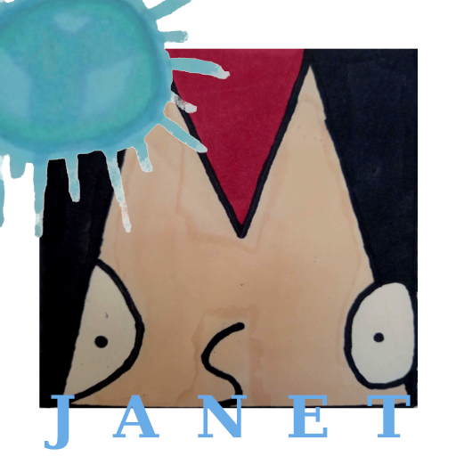

# MODS 45: Janet

Dear Agent 45,

The Scout Team have located the most dangerous magical object to have ever existed, her name: Janet. You have to catch her, but be careful because she has the ability to affect the very fabric of reality, making traps and monsters of the most benign things. 

Good luck Jeff.

Sincerely,
Sir Bob the Great, Head of the MODS
(Magical Object Department Services)

## Mission

In this mission, your goal is to catch Janet, the all powerfull, magical orb, while she tries to slow you down, or even stop you, by creating holes in the ground and turning nice, normal things into evil monsters attacking you. Luckily, your standard issue MODS zapper can turn back the monsters. That's only if your quick enough though. 

## Controls

Use WASD (ZQSD on french keyboards) for movement: W/Z for jumping, A/Q to go left, D to go right. Use the spacebar or left mouse buton to zap evilised enemies and make them nice again.

## Game credits

This game was created by Hugo and Mathieu d'Aquin (Hairy Game Dev) in 48h (well 49 really) for the October edition of Coding Games https://coding-games.fr/

It was created using Unity, with assets 100% made during the 48 hours of the challenge in the DIY way (drawing by hand and making sounds with our mouths). Our code and resources are open source (see LICENSE file), but Unity resources are, naturally, their own.

Enjoy!
